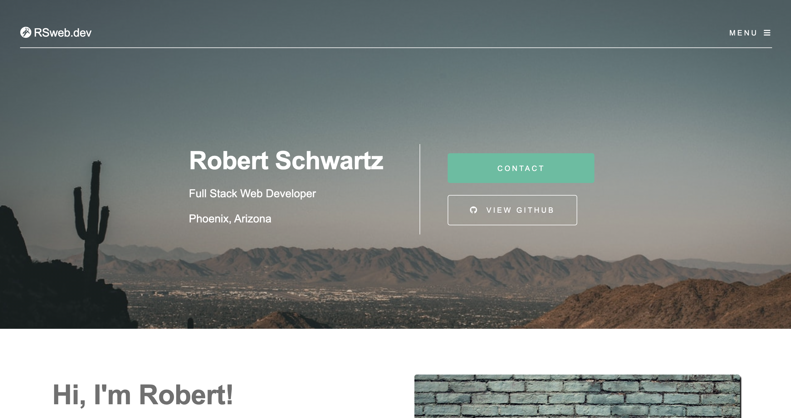

# Robert Schwartz Portfolio Page

GitHub Repo: [https://github.com/Robert-Schwartz/RSweb.dev] 

Deployed at: [https://rsweb.dev/)  

## Description

A portfolio page to display the skills and project examples learned while enrolled in the Full Stack Coding Boot-camp through the University of Arizona.

# Table of Contents

- [Technologies](#Technologies)
- [Usage](#usage)
- [Contributions](#Contributions)
- [Contact](#Contact)
- [License](#license)

## Technologies

This project was built using HTML, CSS, Javascript, as well as Sass.

## Installation

- Clone the repo:

  use: `git clone https://github.com/Robert-Schwartz/RSweb.dev.git` in the command line

## Usage

- Visit deployed website to be taken to the homepage.
- Use the drop down menu in the navigation to view website sections.
- Click on a project to open a new window view of the project

## Contributions

Developed by Robert Schwartz, 2021.
CSS and Sass Framework provided by Pixelarity

## Contact

Contact me with any questions

- Github Profile: (https://github.com/Robert-Schwartz)
- E-mail me: bschwartz23@gmail.com

## License

Pixelarity
